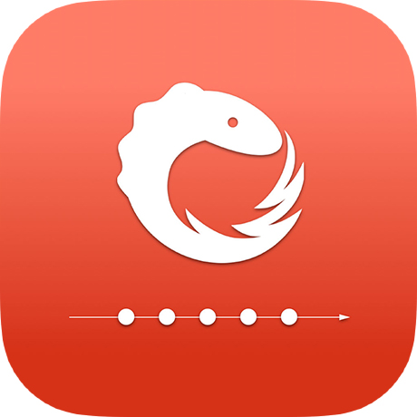
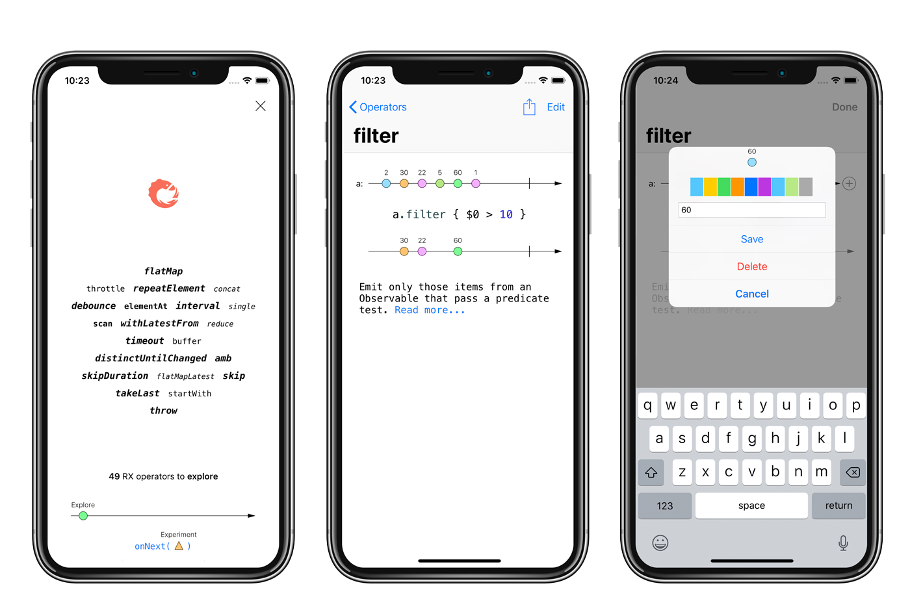

   
  <a href="https://itunes.apple.com/us/app/rxmarbles/id1087272442?ls=1&mt=8" alt="Download on the App Store" target="_blank">

# RxMarbles for iOS

Interactive diagrams of Rx Observables.

ReactiveX is a library for composing asynchronous and event-based programs by using observable sequences.

It extends the observer pattern to support sequences of data and/or events and adds operators that allow you to compose sequences together declaratively while abstracting away concerns about things like low-level threading, synchronization, thread-safety, concurrent data structures, and non-blocking I/O.

